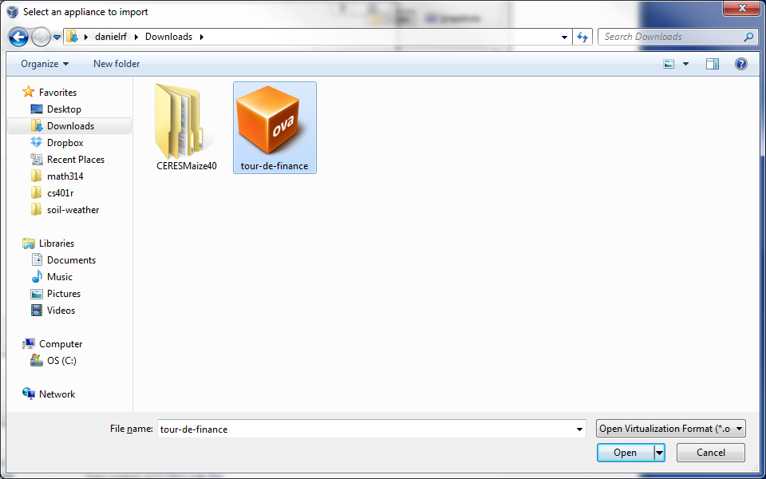

# TDF - Tour de Finance

A paper-trading system for use in studying controls applied to finance.

## Installation of a Virtualbox Image

A recent build of TDF can be downloaded, imported into, and run from virtual box without requiring the installation of the TDF source or dependencies. To do this:

1. Download and install Virtualbox from [virtualbox.org/wiki/Downloads](https://www.virtualbox.org/wiki/Downloads)
2. Download the TDF Virtual Appliance from [ideaquant.cs.byu.edu/tour-de-finance.ova](http://ideaquant.cs.byu.edu/tour-de-finance.ova)
3. Start Virtualbox
	
4. Within Virtualbox, navigate to `file > Import Appliance`
	
5. Click `Open appliance`
	
6. Navigate to the location where you downloaded the TDF Virtual Appliance and open the file `tour-de-finance.ova`
	
7. Click `Next`
	
8. Click `Import`. Virtualbox will begin importing TDF. This may take a while.
	
	
9. Now you will have a Virtualbox instance with the name in the form of `deploy_...`. Highlight this instance and click the green `start` button
	
10. Click `Next` on any dialogue box that pops up
	
	
11. Your machine will boot up
	
12. Eventually your machine will be booted. You can now minimize the virtual machine as you won't need to login here
	
13. Now, you should be able to get to the TDF webapp by going to [localhost:3000](http://localhost:3000/) in any web browser
	
14. If you ever need to close the virtual machine, just try to close it like any other program. (Red box in upper right hand corner). Then select `Power off the Machine` when the following dialogue box opens. TDF will then be exited safely
	

## Installation from Source

Note that this installation has only been tested using Ubuntu 13.10.

### Step 1: Install node.js

Follow the instructions [here](https://github.com/joyent/node/wiki/Installing-Node.js-via-package-manager). For Ubuntu (recommended):

	sudo apt-get update
	sudo apt-get install python-software-properties python g++ make
	sudo add-apt-repository ppa:chris-lea/node.js
	sudo apt-get update
	sudo apt-get install nodejs

### Step 2: Install Grunt and Bower

Install both grunt, the grunt client, and bower globally by:

	sudo npm install -g grunt grunt-cli bower

### Step 3: Install and start MongoDB

Follow the instructions [here](http://docs.mongodb.org/manual/tutorial/install-mongodb-on-ubuntu/). In brief:

	sudo apt-key adv --keyserver hkp://keyserver.ubuntu.com:80 --recv 7F0CEB10
	echo 'deb http://downloads-distro.mongodb.org/repo/ubuntu-upstart dist 10gen' | sudo tee /etc/apt/sources.list.d/mongodb.list
	sudo apt-get update
	sudo apt-get install mongodb-10gen

Once MongoDB is installed, start it by:

	sudo service mongodb start

You can stop MongoDB by:

	sudo service mongodb stop

You can also restart MongoDB by:

	sudo service mongodb restart

### Step 4: Install Project Dependencies

Follow the directions [here](https://github.com/ekalinin/nodeenv/issues/24) to enable npm to install packages locally. In brief:

	sudo chown -fR myusername:myusername ~/.npm ~/tmp

Navigate to the tdf directory and execute the following commands:

	npm install

Note, you should never need to do a `sudo npm install`.

If you get a git error 128, you may need to switch the url protocol to https:// (instead of git://). To do this:

	git config --global url."https://".insteadOf git://

### Step 5: Run the Grunt Server

In the tdf directory, start the grunt server by:

	grunt

If everything is installed properly, you will get a message stating that the server is running on port 3000. Navigate to [localhost:3000](http://localhost:3000) to access TDF.

## Getting Started

Once you have installed TDF, you will need to begin by creating a league. To do this, you will need an admin account. For now, an admin account is created by registering an account with the username `admin` (this will be changed in the future for greater security and flexibility of admins).

After loging in with the admin account, click on `Leagues` in the top navigation bar, and then click the button to add a league. Enter a name of the league and then, if you wish, modify the rest of the league parameters. 

Now that you have a league, you and other users can register agents to trade and compete within this league.

## Back-end Trading

To make a trade on the backend, you must first create an agent through the web client. To do this:

1.  Login or register with the site
2.  Click on the 'My Agents' link in the top navigation bar
3.  Above the desired league, click on the 'Create an Agent' button

Once you have created the agent, navigate to the agent's view if you are not there already (after creating an agent, the site automatically redirects to the agent view). To do this:

1.  Click on the 'My Agents' link in the top navigation bar
2.  Locate the agent in your list of agents, and click on the view button to the right of the agent's name

In the agent view, note the following:

*  The agent's id
*  The agent's api key (you will need to click on the show button to the right of the key to display it)

To trade in any language, create an HTTP post. The url will be `<host>/agents/trade/<agent-id>`, where `host` is the url pointing to the TDF server and `<agent-id>` is the id noted from the agent view.

The data for the post will consist of key-value pairs where each key represents a ticker symbol in the list of ticker symbols allowed by the league (currently only and all symbols in the S&P500), and the value is the number of trades of that security to sell, where negative quantities signify a sell and positive signify a buy.

Further, the data must also pass the key `apikey` with the value of the api key noted from the agent's view.

Each `<symbol i>=<quantity i>` refers to a trade for the security represented by the Yahoo Finance ticker simbol `<symbol i>`. Positive quantities `<quantity i>` refer to a buy, where negative quantities refer to a sell.

### Responses and Errors from Trading

If the trade is successfull, the server will respond with a JSON object representing the agent's info and current status. Otherwise, it will return a JSON object describing the error encountered.

## Querying Historical Data

The historical data for any symbol tracked by the system can be queried through the following url:

    <host>/history/<symbol>

where `<host>` is the location of TDF and `<symbol>` is the ticker symbol for the desired security.

The response is a JSON object of the following form:

    {
        "current": {
            "ask": <real-time ask price>,
            "bid": <real-time bid price>,
            "last": <real-time last price>
        },
        "ask": {
            <JavaScript date of most recently scraped data>: <ask at date>,
            ...
            <JavaScript date of first scraped data>: <ask at date>
        },
        "bid": {
            <JavaScript date of most recently scraped data>: <bid at date>,
            ...
            <JavaScript date of first scraped data>: <bid at date>
        },
        "last": {
            <JavaScript date of most recently scraped data>: <last at date>,
            ...
            <JavaScript date of first scraped data>: <last at date>
        }
    }
    
## Querying the Agent's Portfolio Composition

A user can query to receive the current composition of an agent's portfolio and the values of all securities in the portfolio through the following URL:

    <host>/agents/<agent-id>/composition?apikey=<apikey>
	
where `<host>` is the location of TDF, `<agent-id>` is the agent's public id, and `<apikey>` is the agent's private api key.

The response is a JSON object of the following form:

    {
        "uninvested_cash": <Total Uninvested Cash>,
        "<Symbol 1>": {
            "quantity": <Number of shares invested in <Symbol 1>>,
            "price": <Price of one share of <Symbol 1>>,
            "value": <Value of investment in <Symbol 1>, quantity * price>
        },
        ...
        "<Symbol n>": {
            "quantity": <Number of shares invested in <Symbol n>>,
            "price": <Price of one share of <Symbol n>>,
            "value": <Value of investment in <Symbol n>, quantity * price>
        },
        "total_value": <Total value of portfolio = uninvested_cash + sum_{i = 1 to n} value(<symbol i>)>
    }
